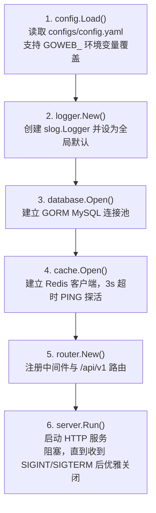
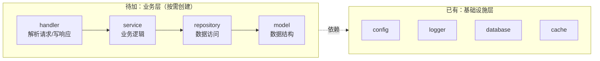

# go-web-template

个人 Go Web 开发脚手架，用于沉淀通用的工程基础设施代码，作为后续业务项目的启动起点。

## 项目定位

这是一个面向基础设施部分（配置加载、日志、数据库连接、缓存连接、路由骨架、优雅关闭……）沉淀成一份可复用的脚手架。新项目从这里 fork/复制之后，直接在 `internal/` 下补充业务的 handler / service / repository 即可，不用再从零搭这一层。

## 技术栈

| 分类 | 选型 | 版本 |
|---|---|---|
| 语言 | Go | 1.26.6 |
| Web 框架 | [Gin](https://github.com/gin-gonic/gin) | v1.12.0 |
| ORM | [GORM](https://gorm.io/) + MySQL driver | v1.31.2 / v1.6.0 |
| 缓存客户端 | [go-redis/v9](https://github.com/redis/go-redis) | v9.22.0 |
| 配置管理 | [Viper](https://github.com/spf13/viper) | v1.21.0 |
| 日志 | 标准库 `log/slog` | — |
| 本地依赖编排 | Docker Compose（MySQL 8.4 + Redis 7.4） | — |

## 目录结构

```
go-web-template/
├── cmd/
│   └── server/
│       └── main.go              # 程序入口：按顺序组装并启动各个组件
├── internal/
│   ├── config/
│   │   └── config.go            # 基于 Viper 的配置加载（YAML + 环境变量覆盖）
│   ├── logger/
│   │   └── logger.go            # 基于 slog 的结构化日志初始化
│   ├── database/
│   │   └── mysql.go             # GORM + MySQL 连接池的建立与关闭
│   ├── cache/
│   │   └── redis.go             # Redis 客户端的建立（含 PING 探活）与关闭
│   ├── middleware/
│   │   └── request_logger.go    # Gin 请求日志中间件
│   ├── router/
│   │   └── router.go            # 路由与中间件注册
│   └── server/
│       └── server.go            # HTTP 服务启动 + 优雅关闭
├── configs/
│   └── config.example.yaml      # 配置文件模板（真实的 config.yaml 被 gitignore）
├── compose.yaml                 # 本地开发依赖：MySQL + Redis
├── go.mod / go.sum
└── .gitignore
```

当前只有基础设施层，还没有 `handler` / `service` / `repository` / `model` —— 这些留给具体业务项目在此基础上添加，见下文"扩展业务功能"。

## 架构：启动流程

`cmd/server/main.go` 里的 `run()` 是整个项目的骨架，按固定顺序组装组件，任何一步出错就直接返回：



每一步的错误都用 `fmt.Errorf("...: %w", err)` 包装后原样返回，最终由 `main()` 里的 `log.Fatal` 统一终止进程；MySQL 和 Redis 一旦初始化成功，都会立刻用 `defer` 注册对应的关闭逻辑。

## 快速开始

**前置依赖**：Go 1.26.6+、Docker（跑本地 MySQL/Redis）。

```bash
# 1. 克隆项目
git clone https://github.com/jasper0507/go-web-template.git
cd go-web-template

# 2. 准备配置文件（config.yaml 已被 gitignore，从模板复制一份）
cp configs/config.example.yaml configs/config.yaml

# 3. 启动本地依赖（MySQL 8.4 + Redis 7.4）
docker compose up -d

# 4. 下载依赖并运行
go mod download
go run ./cmd/server

# 5. 验证
curl http://localhost:8080/api/v1/ping
curl http://localhost:8080/api/v1/health
```

`configs/config.example.yaml` 里的默认值就是按 `compose.yaml` 里的账号密码配的，本地开发不用改就能直接连上。

## 配置说明

配置文件默认路径是 `configs/config.yaml`，可以用环境变量 `GOWEB_CONFIG_FILE` 换成别的路径（比如部署环境用 `/etc/goweb/config.yaml`）。

除了换文件路径，每一项配置本身也能被环境变量覆盖：前缀 `GOWEB_`，把 key 里的 `.` 换成 `_` 再整体转大写。例如 `mysql.password` 对应 `GOWEB_MYSQL_PASSWORD`，`redis.addr` 对应 `GOWEB_REDIS_ADDR`。这套机制由 Viper 的 `AutomaticEnv()` + `SetEnvKeyReplacer` 实现，同一个配置项，环境变量优先级高于配置文件。

## 各模块说明

### config —— 配置加载
`viper.New()` 单独创建实例而不是用全局单例，`ReadInConfig` 读 YAML，`Unmarshal` 反序列化进 `Config` struct。项目其余代码只依赖 `*config.Config`，不直接接触 Viper —— 以后想换配置方案，改这一个文件就够了。

### logger —— 结构化日志
封装 `log/slog`：把配置里的字符串 level（如 `"debug"`）用 `slog.Level.UnmarshalText` 解析成 `slog.Level`；format 决定用 `NewJSONHandler` 还是 `NewTextHandler`，两者都不支持时直接报错。`main()` 创建 logger 后立刻 `slog.SetDefault()`，所以项目其他地方可以直接调用包级函数 `slog.Info(...)`，不用到处传 logger 实例。

### database —— MySQL / GORM
`Open()` 拼 DSN（固定带 `charset=utf8mb4&parseTime=true&loc=Local`）、`gorm.Open`，再取出底层 `*sql.DB` 设置连接池三件套（`SetMaxOpenConns` / `SetMaxIdleConns` / `SetConnMaxLifetime`）。`Close()` 做对称的清理。

### cache —— Redis
`Open()` 本身不关心超时时长，只用调用方传入的 `context` 执行一次 `PING`；`main.go` 里传的是 3 秒超时的 context，连不上就直接返回错误并关闭客户端，不会让服务带着一个连不上的 Redis 继续启动。`Close()` 做对称的清理。

> `database` 和 `cache` 都遵循 `Open(cfg) (client, error)` + `Close(client) error` 的对称接口，`main.go` 拿到实例后立刻用 `defer` 注册关闭 —— 这是这个脚手架里资源生命周期管理的统一模式，以后加新的外部依赖（比如 MQ、ES）建议照这个模式写。

### middleware —— 请求日志
记录 method / path / query / status / latency / client_ip / body_size，在 `c.Next()` 之后统一打一条 `slog.Info("request", ...)`；如果 handler 往 `c.Errors` 里塞了错误，额外打一条 `slog.Error`。

### router —— 路由注册
用 `gin.New()` 而不是 `gin.Default()`（后者会自带官方的 Logger/Recovery），换成了自己的 `RequestLogger` + `gin.Recovery()`。路由都挂在 `/api/v1` 分组下，目前只有 `/ping` 和 `/health` 两个探活接口。

### server —— 启动与优雅关闭
`ListenAndServe` 放到单独的 goroutine 里跑，主 goroutine 用 `select` 同时监听服务器错误 channel 和 `SIGINT`/`SIGTERM` 信号；收到退出信号后，给 `Shutdown` 一个 5 秒超时的 context，等现有请求处理完再退出，不是直接掐断连接。

## 当前 API

| 方法 | 路径 | 说明 |
|---|---|---|
| GET | `/api/v1/ping` | 存活探测，返回 `{"message":"pong"}` |
| GET | `/api/v1/health` | 健康检查，返回 `{"status":"ok"}` |

## 扩展业务功能

这套脚手架目前只有基础设施，落地一个具体业务时建议按三层结构在 `internal/` 下继续加目录：



- `internal/handler/`：只做参数绑定、调用 service、组装响应，不写业务逻辑
- `internal/service/`：业务逻辑本体，编排一个或多个 repository
- `internal/repository/`：唯一直接碰 `*gorm.DB` / `*redis.Client` 的地方，对上暴露领域方法而不是暴露 SQL
- `internal/model/`：GORM 数据模型 + 请求/响应用的 DTO

路由注册方式不变，在 `router.New()` 里新增分组、把 handler 接进去即可。

## 尚未实现

记录一下目前明确还没做、以后要补的部分：

- 业务分层（handler/service/repository/model）—— 见上一节
- 数据库迁移（GORM `AutoMigrate` 或引入 `golang-migrate` / `goose`），目前 schema 完全靠手动维护
- 统一响应结构 / 统一错误处理（目前每个 handler 各写各的 `gin.H`）
- 鉴权（JWT 中间件）
- 单元测试 / 集成测试，仓库里目前没有任何 `_test.go`
- 应用自身的 Dockerfile —— `compose.yaml` 现在只编排了 MySQL 和 Redis，Go 程序本身还是本地直接跑
- API 文档（Swagger/OpenAPI）
- CI（lint、test、build）

## 开发历程

按 commit 顺序，基础设施是这样一层层搭起来的，可以当作下次搭新脚手架的顺序参考：

1. `go mod init` + 基础目录结构，跑通一个最小 Gin 服务
2. Docker Compose 编排本地 MySQL + Redis
3. 接入 Viper，实现 YAML 配置加载和 HTTP 地址读取
4. 接入 `slog`，做成可配置（level/format）的结构化日志
5. 接入 MySQL（GORM），在启动流程里初始化
6. 接入 Redis，和 MySQL 一起在启动流程里初始化
7. 把路由注册从 `main.go` 抽成独立的 `router` 包
8. 补上优雅关闭、修正配置默认值和 `server.Run` 的参数顺序
9. 加请求日志中间件
10. 把健康检查接口挂到 `/api/v1` 下，做成版本化路径
